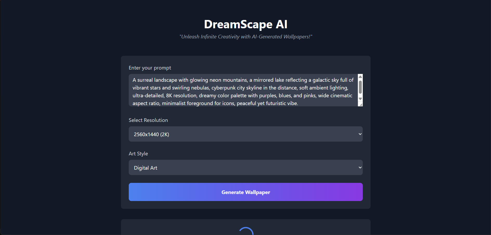

# DreamScape AI

DreamScape AI is a web application that allows users to generate AI-powered wallpapers based on their custom prompts. Built with HTML, Tailwind CSS, and GSAP for animations, it leverages the DeepSeek API (via Hugging Face) to create stunning, high-quality wallpapers in various styles and resolutions.

 <!-- Replace with your actual screenshot URL -->

## Features

- **Custom Prompts**: Describe your desired wallpaper using natural language.
- **Resolution Selection**: Choose from multiple resolutions (1024x1024, 1920x1080, 2560x1440).
- **Art Styles**: Select from various art styles like Digital Art, Oil Painting, Watercolor, Minimalist, and Abstract.
- **Download Wallpapers**: Save your generated wallpapers directly to your device.
- **Responsive Design**: Works seamlessly on both desktop and mobile devices.

## How It Works

1. Enter a prompt describing your desired wallpaper.
2. Select the resolution and art style.
3. Click "Generate Wallpaper" to create your custom wallpaper.
4. Download the wallpaper or generate a new one.

## Setup Instructions

### Prerequisites

- A modern web browser (Chrome, Firefox, Safari, etc.).
- An API key from [Hugging Face](https://huggingface.co/) for the DeepSeek API.

### Steps

1. Clone this repository:
   ```bash
   git clone https://github.com/Bhavu7/dreamscape-ai.git
   cd dreamscape-ai

